# Wenyan Book Video

Pipeline that converts the Wenyan Book (《文言陰符》) into narrated video chapters with generated audio, transcripts, translations, and Remotion compositions.

## Repository Structure

| Path | Purpose |
| --- | --- |
| `book/` | Git submodule tracking [wenyan-lang/book](https://github.com/wenyan-lang/book); keep it synced instead of editing files directly. |
| `processor/` | Python (uv-managed) tools that parse chapters, segment sentences, translate, transcribe, and synthesize audio. |
| `renderer/` | Remotion project plus scripts that turn processor output into React components and videos. |
| `renderer/public/**` | Generated JSON, transcripts, and audio assets that the renderer consumes. |
| `renderer/src/generated/` | Segment metadata emitted by `bun run scripts/generate-segments.ts`. |
| `transcription-utils/` | Helpers shared by multiple processor scripts. |

Large media trees such as `renderer/public/audios/`, `renderer/public/transcripts/build/`, and `renderer/src/generated/segments-*.ts` are reproducible—regenerate them via the pipeline instead of editing by hand.

## End-to-End Pipeline

```mermaid
flowchart LR
    subgraph Source
        BMD[book/*.md\nWenyan Book text]
    end

    subgraph Processor
        PM[parse-markdown.py → renderer/public/chapters]
        BS[build-sentences.py → renderer/public/sentences]
        SG[segment-text.py → renderer/public/segments]
        TR[translate.py → renderer/public/translations]
        TS[transcribe.py → renderer/public/transcripts]
        BS2[build-segmented-transcripts.py → renderer/public/transcripts/build]
        SY[synthesize.py → renderer/public/audios]
        VC[voice-change.py → renderer/public/audios/female]
        TT[transcribe-titles.py → renderer/public/transcripts/audio-n.txt]
        TA[synthesize-titles.py → renderer/public/audios/audio-n.mp3]
    end

    subgraph Renderer
        GS[bun run scripts/generate-segments.ts → renderer/src/generated/segments-*.ts]
        RV[bun run remotion render → final videos]
    end

    BMD --> PM --> BS --> SG --> TR --> TS --> BS2 --> SY --> VC --> GS --> RV
    PM --> TT --> TA --> GS
```



Consult [processor/README.md](processor/README.md) for script-by-script details.

## Getting Started

### Clone & Install

```bash
git clone <repo-url>
cd wenyan-book-video
git submodule update --init --recursive
bun install
```

- Always use `bun` (`bun install`, `bun run …`) for JavaScript/TypeScript workspaces.
- Python tooling inside `processor/` is managed by [uv](https://github.com/astral-sh/uv). Run scripts with `uv run …` so imports resolve against the package.

### Development Environments

**Nix Flake shell (recommended)**

```bash
nix develop          # or allow direnv and just `cd` into the repo
```

The flake provides Python 3.13, uv, Bun, Node 20, ffmpeg, sox, espeak-ng, git, and other CLI dependencies. Python packages are synced automatically via `uv sync` when entering the shell.

**Manual setup**

1. Install [Bun](https://bun.sh) and run `bun install` at the repo root.
2. Install uv (`pip install uv` or via package manager) and run `uv sync` inside `processor/`.
3. Ensure system packages `ffmpeg`, `sox`, and `espeak-ng` are available for the audio pipeline.

## Working the Pipeline

1. **Prepare chapter data**
   - Run processor scripts in order (`parse-markdown.py`, `build-sentences.py`, `segment-text.py`, `translate.py`, `transcribe.py`, `build-segmented-transcripts.py`). Use `uv run` for each, e.g. `cd processor && uv run python segment-text.py`. Use `-c <chapter>` for `build-segmented-transcripts.py` to limit scope.
   - Titles follow `transcribe-titles.py` → `synthesize-titles.py`.

2. **Synthesize audio**
   - `uv run python synthesize.py` produces raw TTS chunks under `renderer/public/audios/`. Use `-c <chapter>` to limit to one chapter.
   - `uv run python voice-change.py` transforms them (e.g., female timbre) into `renderer/public/audios/female/`.

3. **Generate renderer segments**
   - From `renderer/`, run `bun run scripts/generate-segments.ts`. This snapshots current processor artifacts into `renderer/src/generated/segments-*.ts` consumed by the Remotion components.

4. **Render videos**
   - Still in `renderer/`, execute `bun run remotion render`. Confirm that the `renderer/src/generated/segments-*.ts` files and audio/transcript assets exist beforehand.

### Handy Commands

- `segment-text` – launches marimo for `processor/segment-text.py` with live reload.
- `voice-change` – launches marimo for `processor/voice-change.py`.
- `main` – convenience entry point defined in the dev shell for orchestrating the processor pipeline.

All three are available inside `nix develop` (or via `direnv`).

### Submodule maintenance

Update the Wenyan text submodule without touching its tracked files directly:

```bash
git submodule update --remote book
git add book
git commit -m "Update Wenyan book submodule"
```

## Troubleshooting

- **Missing Python deps** – `cd processor && uv sync` rehydrates from `uv.lock`.
- **C library/FFmpeg issues** – make sure you are inside `nix develop` or have the binaries installed locally.
- **Regenerating assets** – delete problematic items under `renderer/public/audios/`, `renderer/public/transcripts/build/`, or `renderer/src/generated/` and rerun the relevant scripts instead of editing the outputs.

## License

This project is released under the [MIT License](LICENSE).
