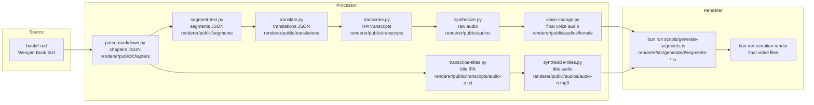

# Wenyan Book Video

A project for creating videos from the Wenyan Book (《文言陰符》).

## Repository Structure

This is a monorepo containing:

- **`book/`** - Git submodule pointing to [wenyan-lang/book](https://github.com/wenyan-lang/book)
- **`processor/`** - Python scripts for processing text, audio, and video
- **`segments/`** - Text segments for video generation
- **`audios/`** - Audio files
- **`transcripts/`** - Transcript files
- **`timings/`** - Timing data for video synchronization

## Basic Workflow

1. Clone the repository
2. Process the text data to generate required for rendering, the steps are defined in [processor/README.md](processor/README.md)
3. Generate renderer segments file by running `bun run scripts/generate-segments.ts` in [renderer/](renderer/)
4. Render video by running `bun run remotion render` in [renderer/](renderer/)

## Data Flow Overview



## Setup

### Cloning the Repository

When cloning this repository, make sure to initialize submodules:

```bash
git clone <repo-url>
cd wenyan-book-video
git submodule update --init --recursive
```

### Updating the Book Submodule

To update the book submodule to the latest version:

```bash
cd book
git pull origin main
cd ..
git add book
git commit -m "Update book submodule"
```

Or from the root:

```bash
git submodule update --remote book
```

## Development

See [README-NIX.md](README-NIX.md) for Nix-based development environment setup.

## Commands

- `segment-text` - Edit segment-text.py with marimo
- `voice-change` - Edit voice-change.py with marimo
- `main` - Run main.py

## License

This project is released under the [MIT License](LICENSE).
